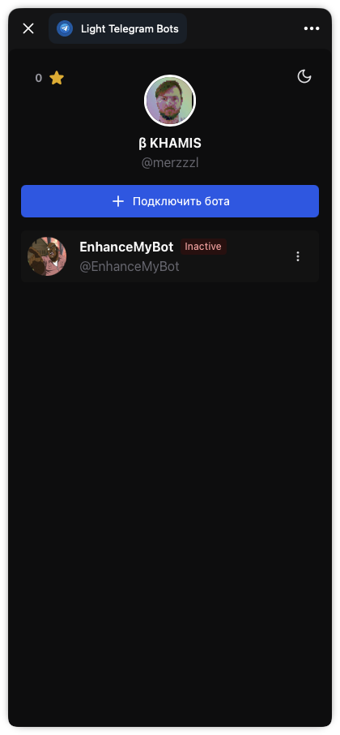
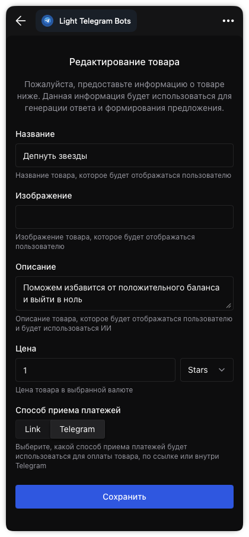
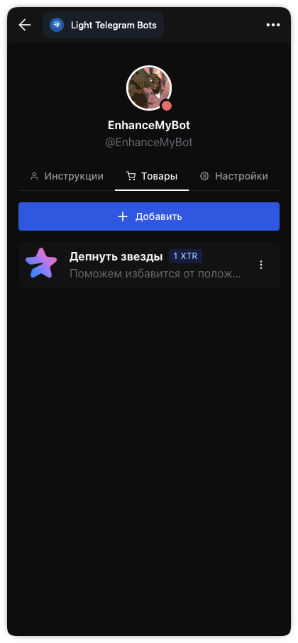

# Light Telegram Bots

**Light Telegram Bots** is a Telegram Mini App platform for running AI-assisted bots: connect a bot, configure its agent, manage products/services, and accept payments inside Telegram.

## What’s inside

- **Frontend (Telegram Mini App UI)**  
  https://github.com/ltbots/frontend

- **Backend (AI and Telegram integrations)**  
  https://github.com/ltbots/backend

- **Contracts / API clients (protobuf, swagger and Go/TS clients)**  
  https://github.com/ltbots/protocols

- **Deployment examples (docker-compose for the whole stack)**  
  https://github.com/ltbots/compose

## Architecture

- The **Mini App UI** talks to the **backend API**.
- The **backend** integrates with Telegram (bot/webhooks), uses an LLM provider for agent responses, and stores data in a database.
- The API surface is defined in **protobuf contracts** and shared across services/clients.
- **docker-compose examples** wire everything together for a full local/hosted deployment.

## Repository map

This project is split into focused repos by responsibility:
- UI is isolated from backend runtime concerns.
- Backend is isolated from interface definitions.
- Contracts are versioned independently so clients and services stay in sync.
- Compose examples show “how to run it all” without mixing infra into product code.

## Screenshots

  
  
  

